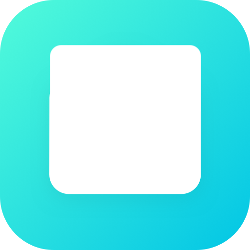

# ioBroker.euhome

[](https://www.npmjs.com/package/iobroker.euhome)
[](https://www.npmjs.com/package/iobroker.euhome)


[](https://nodei.co/npm/iobroker.euhome/)

**Tests:** 

## euhome adapter for ioBroker

Adapter for e-Home devices like Robovac

**This adapter uses Sentry libraries to automatically report exceptions and code errors to the developers.** For more details and for information how to disable the error reporting see [Sentry-Plugin Documentation](https://github.com/ioBroker/plugin-sentry#plugin-sentry)! Sentry reporting is used starting with js-controller 3.0.

## Login procedure

Enter the e-Home mail and password.

## Status

euhome.0.id.dps.

## Control

euhome.0.id.dps.

Example:
euhome.0.id.dps.WORK_MODE = Auto to start cleaning

Room cleaning

euhome.0.id.remote.sendCommand

with this you can then

```

{

  }, "method": { "selectRoomsClean",

  "data": {

    "roomIds": [

      2

    ],

    "cleanTimes": 1

  }

}

```

Zone cleaning

```

{"method":"selectZonesClean","data":{"zones":[{"x0":-1130,"y0":646,"x1":-830,"y1":646,"x2":-830,"y2":346,"x3":-1130,"y3":346,"cleanTimes":1,"type":"sweep"}]}}

```

Spot cleaning

```

{"method":"goto","data":{"cleanTimes":1,"target":"spot","x":-179,"y":36}}

```

Map:

It is theoretically possible to query the map but it is not yet possible to display the data as a map

```

a: tuya.m.device.media.latest

et: 3

v: 2.0

postData: {"devId": "xxxxxxxxxxxxx", "size":500, "start":""}

result: {"result":{"devId":"xxxxxxxxxxxxxxxxx","startRow":"7f3f35c7_wpl4a60873b40e7b1aa5fb_307_501","datatype":0,"dataList": ["7d7d007d7d00","7e7d027e7d027e7d007f7d027f7d027f7d00807d02807d02807d00817d02817d02","817d00827d02827d02827d00837d02837d02837d00847d02847d02847d00","857d02857d02857d00867d02867d02867d00867d00". ......

```

## Loginablauf

Die e-Home Mail und Passwort eingeben.

## Status

euhome.0.id.dps.

## Steuern

euhome.0.id.dps.

euhome.0.id.dps.WORK_MODE = Auto um zu starten

Raumreinigung
euhome.0.id.remote.sendCommand
damit kann man dann

```
{
  "method": "selectRoomsClean",
  "data": {
    "roomIds": [
      2
    ],
    "cleanTimes": 1
  }
}
```

Zonenreinigung

```
{"method":"selectZonesClean","data":{"zones":[{"x0":-1130,"y0":646,"x1":-830,"y1":646,"x2":-830,"y2":346,"x3":-1130,"y3":346,"cleanTimes":1,"type":"sweep"}]}}
```

Spotreinigung

```
{"method":"goto","data":{"cleanTimes":1,"target":"spot","x":-179,"y":36}}
```

Map:
Es ist theoretisch möglich die Karte abzufragen aber es ist bisher nicht möglich die Daten als Karte darzustellen

```
a:                 tuya.m.device.media.latest
et:                3
v:                 2.0
postData:          {"devId":"xxxxxxxxxxxxxxxxx","size":500,"start":""}
result:            {"result":{"devId":"xxxxxxxxxxxxxxxxx","startRow":"7f3f35c7_wpl4a60873b40e7b1aa5fb_307_501","datatype":0,"dataList":["7d7d007d7d00","7e7d027e7d027e7d007f7d027f7d027f7d00807d02807d02807d00817d02817d02","817d00827d02827d02827d00837d02837d02837d00847d02847d02847d00","857d02857d02857d00867d02867d02867d00867d00".......
```

https://github.com/tuya/tuya-panel-sdk/blob/1750094e41e48702c2e3d8ba0c54c5858c34ce68/packages/tuya-panel-api/src/robot/gyroDataApi.ts#L111

https://developer.tuya.com/en/docs/app-development/gyrosweeper?id=Ka6o1iax9v0a2

## Discussions / Diskussion und Fragen

<https://forum.iobroker.net/topic/62168/test-adapter-eufy-home-robovac>

## Changelog
### 0.1.6 (2025-01-15)

- fix login

### 0.1.5 (2024-04-23)

- fix login for new devices

### 0.1.4 (2024-04-22)

- fix dps states

### 0.1.2 (2024-04-21)

- correct state path

### 0.1.1 (2024-04-21)

- add mqtt support for new devices

### 0.1.0 (2024-04-20)

- added new device support

### 0.0.3

- (TA2k) initial release

## License

MIT License

Copyright (c) 2023-2030 TA2k <tombox2020@gmail.com>

Permission is hereby granted, free of charge, to any person obtaining a copy
of this software and associated documentation files (the "Software"), to deal
in the Software without restriction, including without limitation the rights
to use, copy, modify, merge, publish, distribute, sublicense, and/or sell
copies of the Software, and to permit persons to whom the Software is
furnished to do so, subject to the following conditions:

The above copyright notice and this permission notice shall be included in all
copies or substantial portions of the Software.

THE SOFTWARE IS PROVIDED "AS IS", WITHOUT WARRANTY OF ANY KIND, EXPRESS OR
IMPLIED, INCLUDING BUT NOT LIMITED TO THE WARRANTIES OF MERCHANTABILITY,
FITNESS FOR A PARTICULAR PURPOSE AND NONINFRINGEMENT. IN NO EVENT SHALL THE
AUTHORS OR COPYRIGHT HOLDERS BE LIABLE FOR ANY CLAIM, DAMAGES OR OTHER
LIABILITY, WHETHER IN AN ACTION OF CONTRACT, TORT OR OTHERWISE, ARISING FROM,
OUT OF OR IN CONNECTION WITH THE SOFTWARE OR THE USE OR OTHER DEALINGS IN THE
SOFTWARE.
